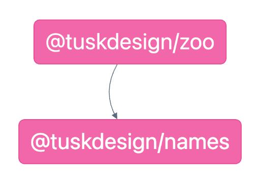
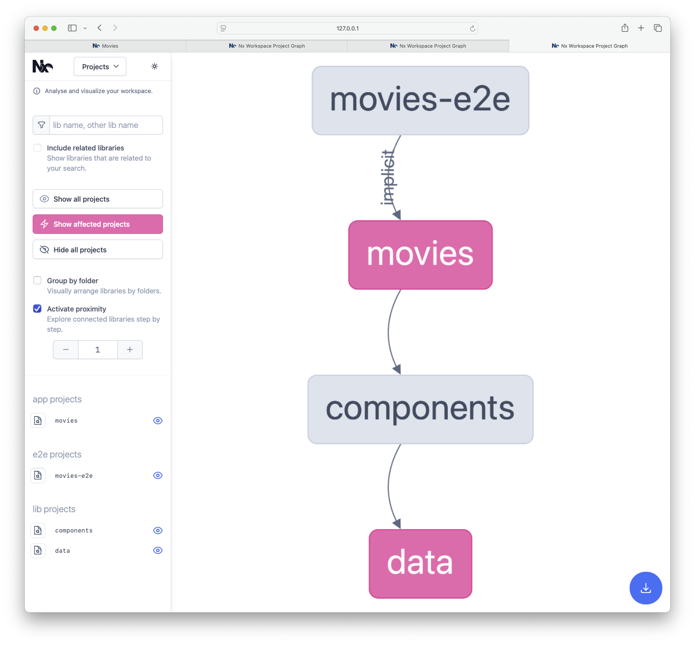

---

**[← Previous: Run Tasks and Task Pipelines](./02-task-pipelines.md) | [Next: Create Libs →](./04-create-libs.md)**

---

# Exercise: Affected & Caching
In this exercise we'll learn how nx improves the way our builds are cached and affected by changes.

## 0. Git commit
In order to have a clean state, we will need to commit our changes. 

<details>
  <summary>Commit changes</summary>

```bash
git commit -a -m "initial monorepo setup"
```

or just use the IDE to commit the changes.

</details>  

### 0.1 Run `build` for all projects
In order to see the effect of the changes, we will need to run the `build` target for all projects.

<details>
  <summary>Run `build` for all projects</summary>

```bash
npx nx run-many -t=build
```

The output should look like this:


</details>

## 1. Make changes
In this part we will make some changes to the code base. And see how the `affected` command works based on where the changes are being made.

### 1.1 Make change in app
First, we will make a change in the `movies` app. Go to the `movies/src/app/app.tsx` file and change the `h1` tag to a `h2` tag.

<details>
  <summary>Change `h1` to `h2` in `movies/src/app/app.tsx`</summary>

```diff
- <h1 style={{ textAlign: 'center' }}>Welcome movies!</h1>
+ <h2 style={{ textAlign: 'center' }}>Welcome movies!</h2>
```

</details>

### 1.2 Affected
In this part we will see how the `affected` command works.
Because we have made a change in the `movies` app, we will see that the `affected` command when we run the build target will only build the `movies` app, and use the build cache for the `data` library because the change didn't affect it.

#### 1.2.1 Affected Project Graph for `build` target
To see the projects that are affected by the change, run the `affected` command.

<details>
  <summary>Run `affected` command</summary>

```bash
npx nx affected --target build --graph
```

The output should look like this:




</details>

#### 1.2.2 Run `build` for affected projects
To see the effect of the change, we will need to run the `build` target for the affected projects.

<details>
  <summary>Run `build` for affected projects</summary>

```bash
npx nx affected --target build
```

The output should look like this:


We can see that the `data` library was not built (but was retrieved from cache), because we didn't make any changes to it.

</details>

#### 1.2.3 Affected Command (nx affected test)
Just like the `build` target, we can skip running the tests for the `data` library by using the `affected` command, and running the `test` target for the affected projects, in our case, the `movies` app.

<details>
  <summary>Run `affected` for `test` target</summary>

```bash
npx nx affected --target test
```


We can see that only the `movies` app was tested.

</details>

### 1.3 Make change in the `data` library
In this part we will make a change in the `data` library.

<details>
  <summary>Change `data` library code</summary>

Open the `use-fetch-movies.ts` file and add a `console.log` statement to the `fetchMovies` function.

```diff
const fetchMovies = async () => {
+  console.log('use-fetch-movies.ts');
  // ...
}
```

</details>

### 1.4 Affected
Let's see how the `affected` command works when we make a change in a leaf library (the `data` library).

#### 1.4.1 Affected Project Graph
Run the `affected` command for the `build` target and see the affected projects.

<details>
  <summary>Run `affected` command for `build`</summary>

```bash
npx nx affected --target build --graph
```

The output should look like this:


We can see that both the `data` library and the `movies` app are affected by the change.

</details>

#### 1.4.2 Affected Task Graph
We saw that for the `build` target, both `movies` and `data` libraries are affected. But, `components` library is affected too when it comes to some other targets, like `test` or `lint`.

<details>
  <summary>Run `affected` command for `lint`</summary>

```bash
npx nx affected --target lint --graph
```

The output should look like this:


</details>

## 2. Local Cache in Action
In this part we will see how the local cache works and how it affects/optimizes the build process.

### 2.1 Build once
In this part we will build the `movies` app once.

<details>
  <summary>Build `movies` app once</summary>

```bash
npx nx build movies
```

The output should look like this:

```
➜  npx nx build movies
   ✔  1/1 dependent project tasks succeeded [0 read from cache] 
   Hint: you can run the command with --verbose to see the full dependent project outputs
———————————————————————————————————————————————————————————
> nx run movies:build
> vite build

vite v5.4.0 building for production...
✓ 40 modules transformed.
......
✓ built in 535ms
———————————————————————————————————————————————————————————
 NX   Successfully ran target build for project movies and 1 task it depends on (2s)
```

</details>

### 2.2 Build again
Now that we already built the `movies` app once, let's see how the build process works when we run the `build` target again.

<details>
  <summary>Build `movies` app again</summary>

```bash
npx nx build movies
```

The output should look like this:

```
➜  npx nx build movies
   ✔  1/1 dependent project tasks succeeded [1 read from cache]
   Hint: you can run the command with --verbose to see the full dependent project outputs
———————————————————————————————————————————————————————————
> nx run movies:build  [existing outputs match the cache, left as is]
> vite build

vite v5.4.0 building for production...
✓ 40 modules transformed.
......
✓ built in 535ms

———————————————————————————————————————————————————————————
 NX   Successfully ran target build for project movies and 1 task it depends on (60ms)
 
Nx read the output from the cache instead of running the command for 2 out of 2 tasks.
```

We will see that the build process is much faster, because the output of the build is read from the cache.

</details>

The second build, lint & test will be much faster, because the output of the target is read from the cache.

---

**[← Previous: Run Tasks and Task Pipelines](./02-task-pipelines.md) | [Next: Create Libs →](./04-create-libs.md)**

---

