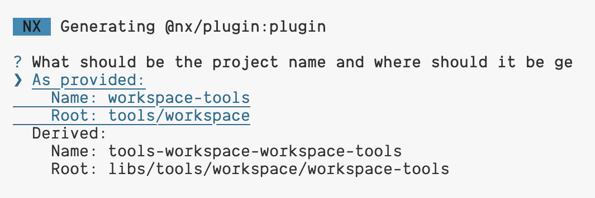

# 📖 Custom Plugin

---

**[← Previous: Module Boundaries](./06-enforce-module-boundaries.md) | [Next: Custom Executors →](./08-custom-executor.md)**

---

✋ Raise your hand to show you've started the exercise. ✋
---

Learn how to create a custom executor with Nx for enhancing your project setup. This guide covers generating a plugin, adopting a custom configuration, and executing the executor to streamline development processes.

This document guides you through creating a custom Nx executor to run Stylelint configuration in your project, ensuring consistent style conventions.

## 0. Add @nx/plugin

Add the `@nx/plugin` plugin with `nx add`.

<details>
  <summary>add `@nx/plugin` plugin</summary>

```bash

npx nx add @nx/plugin

```

</details>

## 1. Generate Plugin

Generate a new plugin called `workspace-tools` in the `tools/workspace` directory.

This step initializes the necessary setup for your custom generator.

<details>
  <summary>generate plugin</summary>

```bash

npx nx generate @nx/plugin:plugin tools/workspace --name workspace-tools

```

</details>



Congratulations, you've successfully generated your first nx plugin ;)

---
👏 Lower your hand to show you've finished the exercise. 👏
---

## 🏃‍♂️‍➡️ Action Steps

**👟 Next Step:**
- Create a custom plugin in your repository

---

**[← Previous: Module Boundaries](./06-enforce-module-boundaries.md) | [Next: Custom Executors →](./08-custom-executor.md)**

---
