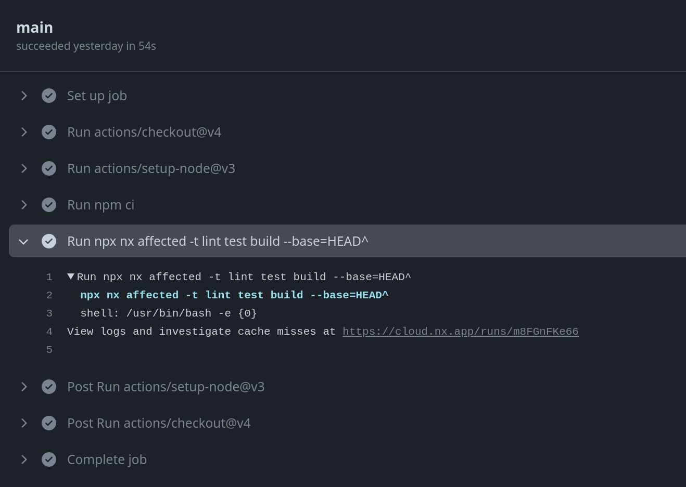
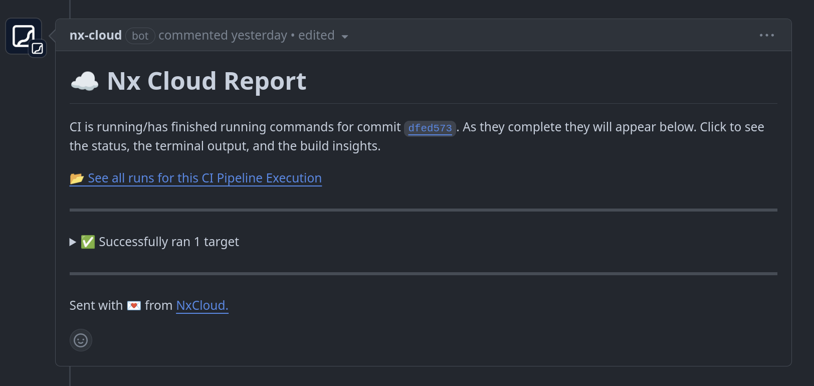

---

**[← Previous: Distributed Caching](./14-distributed-caching.md) | [Next: Nx Agents & DTE →](./16-nx-agents-and-dte.md)**

---

# Exercise: Create a simple CI/CD Pipeline

In this exercise we'll learn how nx improves the way how we write and execute CI/CD pipelines.

## 0. Create a PR on github

Please go to the [repo](https://github.com/push-based/react-movies-app) and create a PR with your changes.

In best case you give it a name that is somehow unique to your name :)

## 1. Create a `.github/workflows/ci.yml` file

Create a new folder `.github/workflows` and create an empty `ci.yml` file.

## 2. Set up the Skeleton

First, the meta. We want it to run only on your branch specifically and treat it as main branch.
That's why we configure the `branches` to your branch name.

<details>
  <summary>CI Meta</summary>

```yaml

name: CI
on:
  push:
    branches:
      - YOUR_BRANCH_NAME # 👈️👈️👈️👈️👈️👈️👈️ IMPORTANT

```

</details>

Now, we can add in the jobs.
For now we only have one job called `main`. It should:

* `checkout`
* `setup-node`
* `run: npm ci`

<details>
  <summary>CI Skeleton</summary>

```yaml

jobs:
  main:
    runs-on: ubuntu-latest
    steps:
      - uses: actions/checkout@v4
        with:
          fetch-depth: 0
      - uses: actions/setup-node@v3
        with:
          node-version: 20
          cache: 'npm'

      - run: npm ci --force

```

</details>

Cool, we now have a CI that spins up a usable node environment and also installs all of our node_modules.

Well done, we are close to getting there!

## 3. Add the nx commands you want to have executed within the CI

Add e.g. `npx nx affected -t lint build` as a run command to get
executed after the `npm ci`.

<details>
  <summary>CI with nx commands</summary>

```yaml

name: CI
on:
  push:
    branches:
      - YOUR_BRANCH_NAME # 👈️👈️👈️👈️👈️👈️👈️ IMPORTANT

jobs:
  main:
    runs-on: ubuntu-latest
    steps:
      - uses: actions/checkout@v4
        with:
          fetch-depth: 0
      - uses: actions/setup-node@v3
        with:
          node-version: 20
          cache: 'npm'

      - run: npm ci
      - run: npx nx affected -t lint build --base=HEAD^

```

</details>


Nicely done, I guess it's time to push and execute :).

## 4. Push & Execute the CI

Run `git push` to push the changes to your branch and watch how the 
CI is getting executed.

You should notice on the first run, that nothing gets executed as nothing
was affected at all.

## 5. Inspect the CI outcome & Dashboard

Nx presents you with useful information about what happened during your CI run.

> [!NOTE]
> Really take your time here to actually play around with the dashboard. It really gives you valuable information
> about any task that is getting executed.

### 5.1 CI Run results

Inspect the CI run results. Expand the section where your pipeline code is executed. It'll give
you information in form of a link that points to the nx cloud dashboard, representing the current run on CI.



There you can inspect the outcome of tasks. You see the stdout of the respective command.

### 5.2 Cloud Report

The Nx cloud report tells you about the outcome of task executions without looking at the pipeline terminals.
Also from here you will get to the nx cloud dashboard, representing the current run on CI.



## 6. Do changes & push

### 6.1 Make the pipeline fail!

Now do some changes and let the pipeline actually execute something - but please let it fail!
Introduce something that will prevent it from succeed. It's easiest to make the lint or some test fail.

> [!TIP]
> Make sure to visit the nx cloud dashboard. It'll tell you the details you want to know :)

### 6.2 Introduce healthy changes

Now do some "healthy" changes and let the pipeline actually execute something that doesn't break. It's up to you what you want to make affected.

> [!TIP]
> Make sure to visit the nx cloud dashboard. It'll tell you the details you want to know :)
> Take especially a look at the cache hit or miss part

## 7. Build Locally

Wait until the pipeline has finished its job and run a local build. 
You should see that you now get the cached output from distributed cache.

## 8. Do changes, warmup cache & push

Now let's do the same trick, but in vice versa.

* Create a change locally
* warmup the cache by running e.g `nx build movies`
* `git push` your changes

Now you can watch the CI using the cache you have produced locally. It's pure beauty 🤌

Make sure to visit the nx cloud dashboard. It'll tell you about cache hits or misses!

---

**[← Previous: Distributed Caching](./14-distributed-caching.md) | [Next: Nx Agents & DTE →](./16-nx-agents-and-dte.md)**

---

