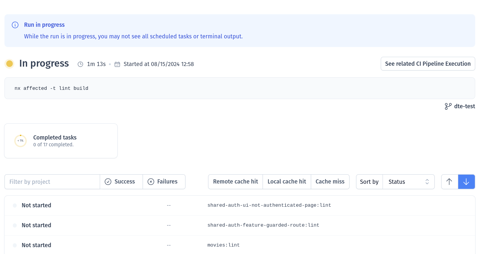
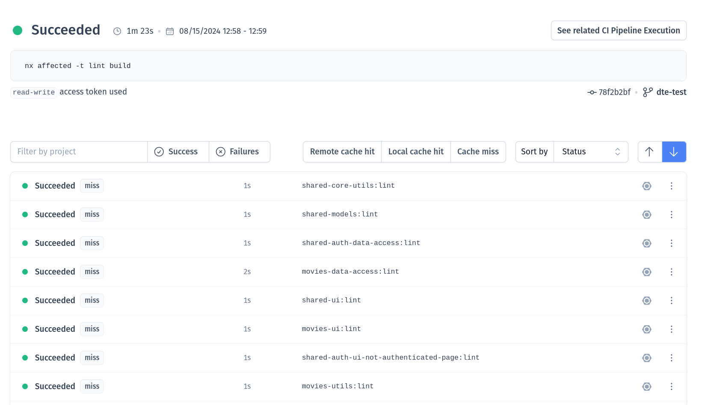

---

**[← Previous: Nx Agents & DTE](./16-nx-agents-and-dte.md) | [Next: Initialize Nx →](./18-initialize-nx.md)**

---

# Exercise: Nx Cloud Agents

In this exercise we'll learn how to use nx cloud agents and distributed task execution that we do not
have to maintain ourselves. Instead we can just let nx cloud handle executions for us.

## Resources

* https://nx.dev/ci/features/distribute-task-execution
* https://nx.dev/ci/features/dynamic-agents

Open the `.github/workflows/ci.yml` file, this will be everything you need
for this exercise.

# 1. Remove the agents again

Go ahead and remove everything related to the `dte_agents` step. You can also just
comment it out, if you want to have it saved for later.

In the end the jobs section should only have the `main` job.

# 2. Adjust the main job

We need to switch from `--distribute-on="manual"` to another launch template, e.g. `3 linux-medium-js`.
This will tell to spawn 3 agents with the `linux-medium-js` template.

You can lookup templates here: https://github.com/nrwl/nx-cloud-workflows/blob/main/launch-templates/linux.yaml

## 2.1 distribute to cloud

Adjust the `npx nx-cloud start-ci-run` command. 
First, it needs to be put **BEFORE** we run `npm ci`.

You can use other templates, but please don't overuse the very strong machines. It would just burn
tokens.

<details>
  <summary>distribute-on predefined templates</summary>

```yaml

- name: Initialize the Nx Cloud distributed CI run
  run: npx nx-cloud start-ci-run --distribute-on="3 linux-medium-js" # 👈️👈️👈️ 

```

</details>


## 2.2 remove the cloud agent stop

We also don't have to deal with manually stopping agents. We can safely remove that step:

REMOVE THAT:
👇️👇️👇️
```yaml
  - name: Stop Nx Cloud DTE agents
    if: ${{ always() }}
    run: npx nx-cloud stop-all-agents
```

## 2.3 remove custom envs

We also can remove any custom `env` declaration from our jobs and main environment.

## 2.4 Full solution

<details>
  <summary>Full pipeline</summary>

```yaml

name: CI

on:
  push:
    branches:
      - YOUR_BRANCH # 👈️👈️👈️👈️👈️ IMPORTANT


concurrency:
  # Group concurrency on workflow, then:
  # - Is merge run? Group on branch name (`refs/heads/main`)
  # - Is pull request? Group on pull request branch name, for example `feat/add-awesome-feature`
  group: >-
    ${{ github.workflow }}-${{
      github.event_name == 'push'
        && github.ref
        || github.head_ref
    }}
  # Run merge workflows in sequence to prevent parallel deployments and releases
  # Cancel stale pull request runs in progress for the same branch
  cancel-in-progress: ${{ github.event_name != 'push' }}

jobs:
  main:
    name: DTE Coordinator
    runs-on: ubuntu-latest

    steps:
      - uses: actions/checkout@v4
        with:
          fetch-depth: 0

      - name: Initialize the Nx Cloud distributed CI run
        run: npx nx-cloud start-ci-run --distribute-on="3 linux-medium-js"
        
      - uses: actions/setup-node@v3
        with:
          node-version: 20
          cache: 'npm'
      - run: npm ci

      - name: Run commands in parallel
        run: npx nx affected -t lint build --base=HEAD^

      - name: Stop Nx Cloud DTE agents
        if: ${{ always() }}
        run: npx nx-cloud stop-all-agents


```

</details>

# 3. Watch it go!

Do some changes that will make your pipeline affected. Inspect the pipelines output
and follow the links to the cloud dashboard executions.

**In Progress**



**Success**




# 4. [OPTIONAL]: Play around with dynamic allocation

Try to introduce dynamic resource allocation, based on the size of the changeset.

Follow the instructions here: https://nx.dev/ci/features/dynamic-agents

You basically have to create `.nx/workflows/dynamic-changesets.yaml` file that determines what
setup to use.

Then u point the `--distribute-on=".nx/workflows/dynamic-changesets.yaml"` and you should be good to go.

As always, don't overdo it with the large machines.

---

**[← Previous: Nx Agents & DTE](./16-nx-agents-and-dte.md) | [Next: Initialize Nx →](./18-initialize-nx.md)**

---
